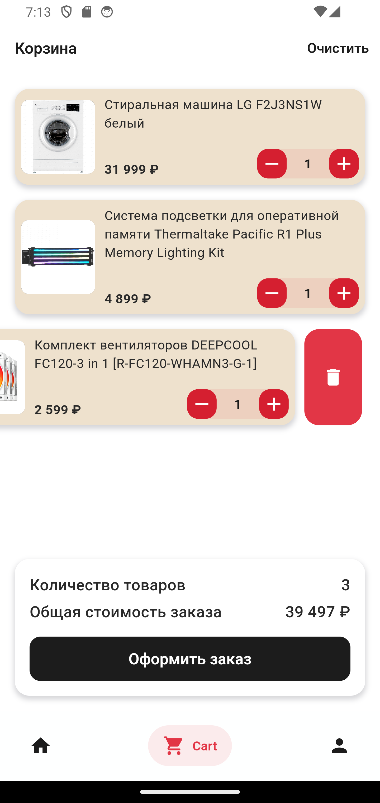

# test_shop_task
## Flutter Test Task

#### Flutter App Screenshots

<table>
  <tr>
    <td>Auth by phone</td>
    <td>Code confirm</td>
    <td>Profile</td>
    <td>Catalog</td>
  </tr>
  <tr>
    <td></td>
    <td></td>
    <td></td>
    <td></td>
  </tr>
  <tr>
    <td>Product List</td>
    <td>Product Detail</td>
    <td>Full screen photo view</td>
    <td>Shopping Cart</td>
  </tr>
  <tr>
    <td></td>
    <td></td>
    <td></td>
    <td></td>
  </tr>
 </table>

## Checklist

- [x] Local storage drift
- [x] go_router
---
- [x] Profile Page
- [x] Edit fields
- [x] Edit avatar
- [x] Miltiple avatars
- [ ] Sliver 
- [ ] Phone country code 
- [x] Validation 
---
- [x] Catalog Page 
- [x] Catalog Page Child
- [x] Catalog Item Image
- [x] Catalog Item Name
- [ ] Catalog Product Count
- [ ] Catalog Search
---
- [x] Product Grid Page 
- [x] Product Detail Page 
- [x] Add to cart
- [x] Product Image
- [x] Product Name
- [x] Product Price
- [x] Product Description
- [x] Product Search
- [ ] Select weight
- [ ] Select volume
- [ ] Select volume on grid (why)?
---
- [x] Cart page
- [x] Clear cart
- [x] Increment, decrement count
- [x] Delete on slide
- [x] Total sum
---